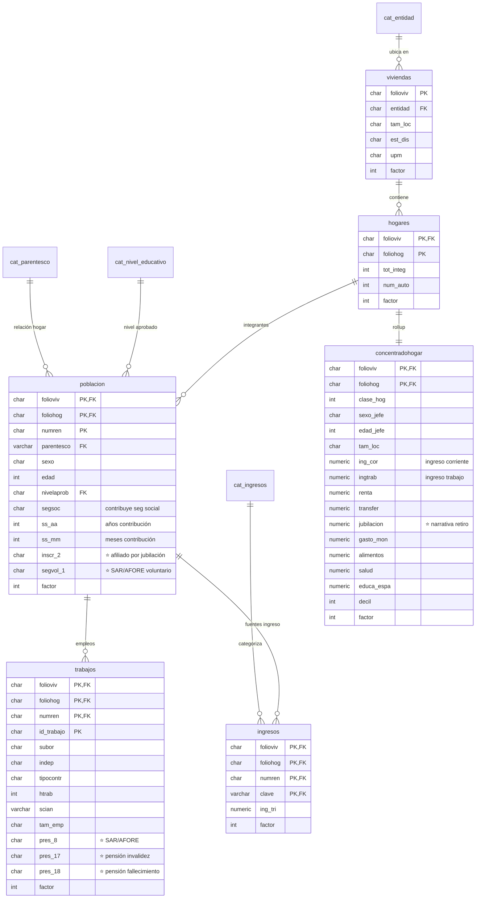

# ENIGH 2024 — Plan de schema para capa 2 del observatorio

**Estado**: diseño — migración `006_enigh_schema.sql` lista pero no ejecutada.
**Fuente**: INEGI, Encuesta Nacional de Ingresos y Gastos de los Hogares 2024 (Nueva Serie), [diccionario oficial](https://www.inegi.org.mx/contenidos/programas/enigh/nc/2024/microdatos/889463924494.pdf) (pp. 1–30).
**Fecha**: 2026-04-21.

## 1. Qué es ENIGH y por qué entra

ENIGH es la encuesta trimestral del INEGI que mide **ingresos y gastos de hogares mexicanos**. Se levanta cada dos años con una muestra probabilística representativa a nivel estatal. ENIGH 2024 es la primera edición publicada en la "Nueva Serie", con variables construidas alineadas a las recomendaciones de la 17.ª Conferencia Internacional de Estadísticos del Trabajo y el Grupo de Canberra.

Para el observatorio aporta la **capa 2** — el hogar mexicano promedio — entre la capa 1 (servidores públicos CDMX) y la futura capa 3 (pensiones / CONSAR). Permite preguntas tipo *"¿un servidor público de CDMX gana/ahorra más o menos que el hogar mexicano mediano de su decil?"*.

## 2. Arquitectura original de ENIGH 2024

INEGI distribuye **16 tablas normalizadas + 1 tabla resumen (CONCENTRADOHOGAR)** con un total de ~960 variables. Tres niveles jerárquicos:

| Nivel | Tablas | Llave |
|---|---|---|
| Vivienda | VIVIENDAS | `folioviv` (10 chars) |
| Hogar | HOGARES, GASTOSHOGAR, EROGACIONES, GASTOTARJETAS, CONCENTRADOHOGAR | `folioviv + foliohog` |
| Persona | POBLACION, INGRESOS, INGRESOS_JCF, GASTOSPERSONA, TRABAJOS | `+ numren` |
| Negocios (por persona) | AGRO, NOAGRO, AGROPRODUCTOS, AGROCONSUMO, AGROGASTO, NOAGROIMPORTES | `+ id_trabajo / tipoact` |

El factor de expansión (`factor`) está en todas las tablas "grandes" y permite generalizar los resultados a la población total (~35M hogares en México).

## 3. Scope: 6 tablas + 4 catálogos, ~38 variables

ENIGH es gigante. Para el observatorio **no necesitamos el 95% de las variables**. Ingerimos lo mínimo alineado con la narrativa *empleo → ingreso → ahorro/retiro*:

### 3.1 Tablas incluidas

| Tabla nuestra | ENIGH origen | Vars originales | Vars incluidas | Rationale |
|---|---|---:|---:|---|
| `enigh.viviendas` | VIVIENDAS | 82 | **6** | Solo identificador + diseño muestral (entidad, tam_loc, est_dis, upm, factor). No nos importa tipo de paredes / techos / focos. |
| `enigh.hogares` | HOGARES | 148 | **5** | Tamaño del hogar (`tot_integ`) y proxy de patrimonio (`num_auto`). El resto son flags de seguridad alimentaria, TV de paga, aparatos — narrativa distinta. |
| `enigh.concentradohogar` ⭐ | CONCENTRADOHOGAR | 126 | **17** | La tabla estrella: rollup trimestral por hogar. Incluimos: `ing_cor` (ingreso total), `ingtrab`, `renta`, `transfer`, **`jubilacion`** (clave para narrativa retiro), `gasto_mon`, `alimentos`, `salud`, `educa_espa`, `decil`, `clase_hog`, `sexo_jefe`, `edad_jefe`, `tam_loc`, `factor`. Descartamos 26 subagregados de gasto (vesti_calz, vivienda, limpieza, transporte, personales...). |
| `enigh.poblacion` | POBLACION | 185 | **13** | Demografía (sexo, edad, parentesco), educación (`nivelaprob`), **seguridad social** (`segsoc`, `ss_aa`, `ss_mm`), **afiliación a salud por jubilación** (`inscr_2`), **ahorro voluntario** (`segvol_1` = SAR/AFORE). Descartamos 172 vars: discapacidades, lengua indígena, uso del tiempo, acceso a salud detallado, enfermedades, etc. |
| `enigh.trabajos` | TRABAJOS | 60 | **14** | Tipo de empleo (`subor`, `indep`, `tipocontr`), horas (`htrab`), industria (`scian`), tamaño empresa (`tam_emp`), y las 3 prestaciones clave: **`pres_8`** (SAR/AFORE), **`pres_17`** (pensión invalidez), **`pres_18`** (pensión fallecimiento). Descartamos las otras 17 prestaciones (aguinaldo, vacaciones, vales, etc.) + medicina laboral + socios de negocio. |
| `enigh.ingresos` | INGRESOS | 21 | **6** | Solo `clave` (FK a catálogo) + `ing_tri` (monto trimestral) + factor. No los desgloses mes-a-mes (`ing_1`..`ing_6`) — ENIGH ya trimestraliza en `ing_tri`. |

**Subtotal variables substantivas** (sin contar PKs, FKs, factor): **2 + 2 + 14 + 9 + 9 + 2 = 38 variables**. Dentro del rango 30-40 acordado.

### 3.2 Catálogos incluidos

| Catálogo | Filas estimadas | Fuente |
|---|---:|---|
| `enigh.cat_entidad` | 32 | PDF §2.4.11 (entidades federativas INEGI) |
| `enigh.cat_parentesco` | ~12 | PDF §2.4.1 (jefe, esposo, hijo, padre/madre, etc.) |
| `enigh.cat_nivel_educativo` | ~12 | Valores de la variable `nivel` |
| `enigh.cat_ingresos` | ~150 | PDF §2.4.8 (claves de ingreso: trabajo P001..P035, negocio N001..N005, renta, transfer P038..P059 jubilación, bienestar, etc.) |

### 3.3 Tablas / variables descartadas

**Tablas enteras fuera de scope para MVP**:
- **GASTOSHOGAR (31 vars), GASTOSPERSONA (23), EROGACIONES (16), GASTOTARJETAS (6)** — microdata de gasto por transacción. Demasiado granular para el análisis narrativo; el rollup del hogar vive en `concentradohogar`. Re-incorporar en un "sprint de gastos" si el alcance lo pide.
- **AGRO (66), NOAGRO (115), AGROPRODUCTOS (25), AGROCONSUMO (11), AGROGASTO (7), NOAGROIMPORTES (17)** — negocios propios. Narrativa ≠ observatorio de retiro. Importante si luego extendemos a informalidad, pero no MVP.
- **INGRESOS_JCF (18)** — específica al programa Jóvenes Construyendo el Futuro. Los ingresos de ese programa ya quedan capturados en `INGRESOS.clave` (código específico); la tabla extra solo duplica registros.

**Variables descartadas dentro de tablas incluidas**: detalladas en los comentarios de `006_enigh_schema.sql`. Criterio: quedarse solo con lo que alimenta la tríada empleo-ingreso-retiro. Todo lo físico (paredes, techos, aparatos, lavadoras), toda la caracterización de consumo granular (alimentos desglosados en 12 tipos, habitos Liconsa/Diconsa, seguros distintos a AFORE), y toda la caracterización médica granular (discapacidades, razones de no atención médica, enfermedades específicas) se omite.

## 4. Diagrama Mermaid del schema propuesto

## 5. Plan de ingesta

### 5.1 Origen de datos

INEGI publica los microdatos de ENIGH 2024 en formato CSV dentro de un ZIP en <https://www.inegi.org.mx/programas/enigh/nc/2024/#Microdatos>. Una CSV por tabla, UTF-8, coma como separador. Requiere captcha humano para descargar, así que el paso de bajar el ZIP es manual (usuario) — el script solo procesa CSVs locales.

### 5.2 Orden de carga (respeta FKs)

1. `cat_entidad`, `cat_parentesco`, `cat_nivel_educativo`, `cat_ingresos` — catálogos primero (los armamos con scripts derivados del PDF diccionario)
2. `viviendas` ← `viviendas.csv`
3. `hogares` ← `hogares.csv` (valida FK a viviendas)
4. `concentradohogar` ← `concentradohogar.csv` (FK a hogares)
5. `poblacion` ← `poblacion.csv` (FK a hogares)
6. `trabajos` ← `trabajos.csv` (FK a poblacion)
7. `ingresos` ← `ingresos.csv` (FK a poblacion + cat_ingresos)

### 5.3 Scripts necesarios (no existen todavía)

- `api/scripts/seed_enigh_catalogs.py` — inserta catálogos desde datos hardcodeados del PDF §2.4
- `api/scripts/ingest_enigh.py` — carga los 6 CSVs usando `asyncpg.copy_records_to_table()` (órdenes de magnitud más rápido que INSERTs individuales). Espera `ENIGH_DATA_DIR` como variable de entorno apuntando al directorio con los CSVs descomprimidos.
- Endpoint opcional: `POST /api/v1/enigh/ingest/` (análogo a `/api/v1/ingest/csv` del CDMX) — **no** necesario para MVP, el script CLI basta.

### 5.4 Validaciones post-ingesta

1. Conteos dentro de ±1% de lo reportado por INEGI en el metadato oficial.
2. `SELECT COUNT(DISTINCT folioviv) FROM enigh.hogares` debe coincidir con `COUNT(*) FROM enigh.viviendas` (integridad referencial).
3. `SELECT SUM(ing_cor) FROM enigh.concentradohogar` × factor debe aproximar el ingreso agregado nacional publicado por INEGI (≈ MXN 4.5 billones trimestrales).
4. Todas las claves de `enigh.ingresos.clave` deben existir en `enigh.cat_ingresos` (test de integridad).
5. `CHECK` en DDL: todo `factor > 0`, `decil ∈ [1,10]`, `tot_integ > 0`.

## 6. Estimación de tamaño post-ingesta

| Tabla | Filas estimadas | Bytes/fila (aprox.) | Tamaño datos |
|---|---:|---:|---:|
| `viviendas` | 95 000 | 50 | 5 MB |
| `hogares` | 97 000 | 30 | 3 MB |
| `concentradohogar` | 97 000 | 180 | 18 MB |
| `poblacion` | 300 000 | 55 | 17 MB |
| `trabajos` | 200 000 | 55 | 11 MB |
| `ingresos` | 200 000 | 40 | 8 MB |
| catálogos | < 200 | — | < 1 MB |
| **Subtotal datos** | | | **62 MB** |
| Índices (7 definidos + PKs) | | +30% | **~20 MB** |
| **TOTAL** | | | **~82 MB** |

Dentro del rango 10–300 MB esperado. No compromete el cap de 3 GB del tier gratuito de Neon (actualmente CDMX usa ~0.5 GB, post-ENIGH quedaríamos ~0.6 GB).

## 7. Preguntas de análisis que habilita este schema

Una vez con datos, debería poder contestar (sin modificaciones adicionales):

1. **Distribución de ingresos por decil** — `SELECT decil, AVG(ing_cor * factor) FROM concentradohogar GROUP BY decil`
2. **Cobertura de retiro** — `% de ocupados con pres_8=1 (SAR/AFORE)` cruzado por `scian` (industria) o `tam_emp` (tamaño empresa)
3. **Hogares con ingreso de jubilación** — `SELECT COUNT(*) * factor FROM concentradohogar WHERE jubilacion > 0 GROUP BY decil`
4. **Brecha de contribución a seg social por sexo/edad** — `poblacion` con `segsoc + ss_aa`
5. **Cruce con CDMX**: comparar mediana de `ingtrab/tot_integ` del CDMX-servidor vs mediana de `ing_cor/tot_integ` del hogar mexicano.

## 8. Siguientes pasos (futura sub-sesión)

1. **Humano**: descargar el ZIP oficial de INEGI (captcha) y descomprimir en `$HOME/enigh2024/`.
2. **Script**: escribir `seed_enigh_catalogs.py` (catálogos a mano desde el PDF §2.4).
3. **Script**: escribir `ingest_enigh.py` con `COPY` bulk loading + validaciones §5.4.
4. **Aplicar**: `006_enigh_schema.sql` en local → validar → en Neon.
5. **Cargar**: catálogos → datos, en orden §5.2.
6. **API**: routers nuevos `app/routers/enigh_analytics.py` (decil, cobertura retiro), análogos a los de CDMX.
7. **Frontend**: segunda sección del dashboard con vistas cruzadas CDMX ↔ ENIGH.

## 9. Riesgos y mitigaciones

| Riesgo | Probabilidad | Mitigación |
|---|---|---|
| `CONCENTRADOHOGAR` trae algún nombre de variable distinto en la Nueva Serie (ej. `ing_cor` → `ingtot`) | media — INEGI dice adoptar recomendaciones Grupo Canberra | Verificar nombres al bajar el CSV; ajustar migración 006 antes de aplicar. |
| Catálogo de claves de ingreso (§2.4.8) mayor que 150 y no cabe en el mapeo `categoria` simple | baja | El campo `categoria` se puede rellenar por bloques (P001-P035 → 'trabajo', P036-P060 → 'transfer', etc.). |
| Tamaño post-ingesta excede 100 MB por Neon cap | muy baja | Dataset histórico ENIGH 2022 fue 55 MB con schema similar. |
| FK entre `ingresos.clave` y `cat_ingresos.clave` falla porque INEGI usa claves con ceros a la izquierda inconsistentes | media | Normalizar a `VARCHAR(4)` en ingesta; script debe `LPAD(clave, 4, '0')`. |
