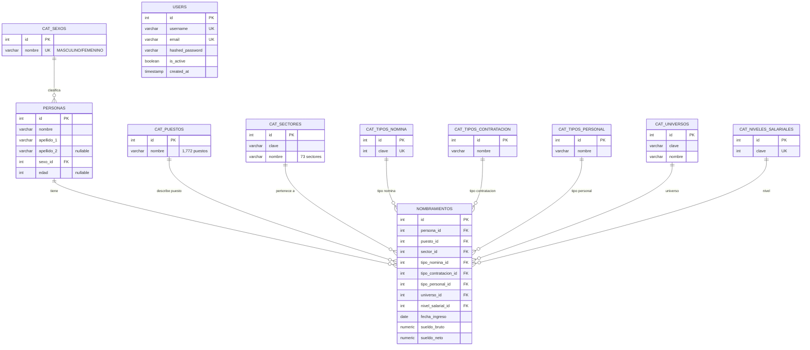

# ER Diagram — `remuneraciones_cdmx` / `neondb`

Auto-generado del schema real (Neon y local son idénticos).

> **Cómo verlo**: abre este archivo en VSCode y pulsa **⌘⇧V** (Open Preview). Mermaid se renderiza nativo desde VSCode 1.82+. Si tu VSCode es más viejo, instala la extensión **"Markdown Preview Mermaid Support"** de Matt Bierner.

---

## Diagrama (Mermaid)



## Notas de normalización (4NF)

- **`personas`** contiene identidad (atributos que dependen solo de la persona: nombre, edad, sexo). Hay 246,821 personas. 1:N con `nombramientos`.
- **`nombramientos`** contiene el vínculo empleado-puesto (atributos que dependen de la combinación persona + puesto: fecha_ingreso, sueldo, tipo de contratación, etc.). Hay 246,821 nombramientos — en esta carga inicial cada persona tiene exactamente 1 nombramiento vigente. El modelo **permite** N:1 para histórico/multi-empleo futuros.
- **8 catálogos** (`cat_*`) eliminan redundancia: en el CSV original todos los valores categóricos se repetían como strings; ahora viven una sola vez con un id numérico.
- **`users`** es tabla aparte para autenticación JWT del API. No está relacionada con el modelo de datos.
- **`v_servidores_publicos`** es una **view** (no tabla) que re-construye la forma desnormalizada del CSV original haciendo JOIN de todo. Útil para validación y compatibilidad con queries legacy.

## Tablas materializadas (no en el ER porque son derivadas)

Para el dashboard hay 5 MVs que NO son parte del modelo relacional — son cachés pre-computadas:

| MV | Filas | Refresca desde |
|---|---|---|
| `mv_dashboard_overview` | 1 | agregados globales de `nombramientos + personas + cat_sexos` |
| `mv_dashboard_sectors` | 73 | `cat_sectores ⨝ nombramientos ⨝ personas` con counts + avg por género |
| `mv_dashboard_top_positions` | 10 | top-10 puestos con AVG(sueldo) |
| `mv_dashboard_salary_by_age` | 5 | 5 buckets etarios |
| `mv_dashboard_seniority` | 6 | 6 buckets de antigüedad |

Refresh: `POST /api/v1/admin/refresh-materialized-views` (JWT-protected), corre `REFRESH MATERIALIZED VIEW CONCURRENTLY` sobre los 5.

---

## Formato alternativo (DBML para [dbdiagram.io](https://dbdiagram.io))

Si prefieres editar el diagrama visualmente (drag-and-drop), copia esto en <https://dbdiagram.io>:

```dbml
Table personas {
  id integer [pk, increment]
  nombre varchar [not null]
  apellido_1 varchar [not null]
  apellido_2 varchar
  sexo_id integer [ref: > cat_sexos.id]
  edad integer
}

Table nombramientos {
  id integer [pk, increment]
  persona_id integer [not null, ref: > personas.id]
  puesto_id integer [ref: > cat_puestos.id]
  sector_id integer [ref: > cat_sectores.id]
  tipo_nomina_id integer [ref: > cat_tipos_nomina.id]
  tipo_contratacion_id integer [ref: > cat_tipos_contratacion.id]
  tipo_personal_id integer [ref: > cat_tipos_personal.id]
  universo_id integer [ref: > cat_universos.id]
  nivel_salarial_id integer [ref: > cat_niveles_salariales.id]
  fecha_ingreso date
  sueldo_bruto numeric
  sueldo_neto numeric
}

Table cat_sexos {
  id integer [pk, increment]
  nombre varchar [unique, not null]
}

Table cat_puestos {
  id integer [pk, increment]
  nombre varchar [not null]
}

Table cat_sectores {
  id integer [pk, increment]
  clave varchar [not null]
  nombre varchar [not null]
}

Table cat_tipos_nomina {
  id integer [pk, increment]
  clave integer [unique, not null]
}

Table cat_tipos_contratacion {
  id integer [pk, increment]
  nombre varchar [not null]
}

Table cat_tipos_personal {
  id integer [pk, increment]
  nombre varchar [not null]
}

Table cat_universos {
  id integer [pk, increment]
  clave varchar [not null]
  nombre varchar [not null]
}

Table cat_niveles_salariales {
  id integer [pk, increment]
  clave integer [unique, not null]
}

Table users {
  id integer [pk, increment]
  username varchar [unique, not null]
  email varchar [unique, not null]
  hashed_password varchar [not null]
  is_active boolean [default: true]
  created_at timestamp
}
```

---

## Tamaños actuales (Neon)

| Tabla | Filas |
|---|---|
| `personas` | 246,821 |
| `nombramientos` | 246,821 |
| `cat_puestos` | 1,772 |
| `cat_sectores` | 73 |
| `cat_tipos_contratacion` | 7 |
| `cat_tipos_personal` | 11 (aprox.) |
| `cat_sexos` | 3 |
| `cat_tipos_nomina`, `cat_universos`, `cat_niveles_salariales` | pequeños |
| `users` | 0 |

Regenera este doc cuando cambie el schema:
```bash
# (cuando tengamos un script de generación)
./api/scripts/regenerate-erd
```
